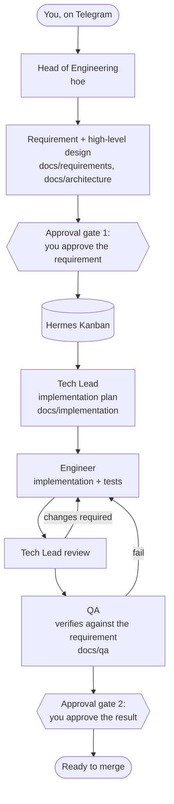

# VPS bootstrap (Ubuntu 24.04)

A reproducible bootstrap for running a [Hermes Agent](https://github.com/NousResearch/hermes-agent) "software factory" on an Ubuntu 24.04 VPS. It installs baseline tools and Docker, creates `/home/<user>/software-factory`, installs a pinned Hermes revision on request, and configures a default Hermes profile plus specialist agent profiles (Head of Engineering, Tech Lead, Engineer, QA) that work through Docker-sandboxed terminals. It also hardens the server: key-only SSH, a UFW firewall, and Fail2ban.

## How it works

You talk to the Head of Engineering (`hoe`) over Telegram. It turns your request into a requirement and a high-level design, asks for your approval, then hands the work through Hermes Kanban to the specialist profiles. A second approval gate comes before anything is merged. The main Hermes profile is also reachable over Telegram for general tasks on the host.



The specialists run their commands in Docker containers that can only see the factory folder. Project state lives in durable artifacts (Markdown docs, Kanban tasks, Git history, QA reports) rather than in chat history, so work survives restarts and agent failures. The full lifecycle and handoff rules are in `config/software-factory/WORKFLOW.md`.

## Prerequisites

- A fresh Ubuntu 24.04 VPS with a non-root sudo user who can log in with an SSH key. If your provider only gives you `root`, run `scripts/create-admin-user.sh <user>` as root first (see below).
- Back up any existing data before applying to a machine that is not fresh.
- Review `ansible/vars.yml`, especially `docker_group_access`. Membership in the Docker group grants broad control of the host.
- By default the main profile, `hoe`, and `techlead` use `gpt-5.6-sol` through the `openai-codex` provider (a ChatGPT subscription), and `engineer` and `qa` use `z-ai/glm-5.3-flash` through OpenRouter (an OpenRouter API key with credits). Change this with `hermes_models`, `hermes_main_model`, and each profile's `model`.

## Settings

Defaults live in `ansible/vars.yml`. To override them without editing tracked files, copy `ansible/local-vars.example.yml` to `ansible/local-vars.yml` (gitignored) and uncomment the keys you want to change. Each top-level key replaces the default; lists are replaced, not merged. `make configure`, `make verify`, `make hermes-install`, and `make image-qa` all read the same combined settings through `scripts/effective_vars.py`.

Notable settings:

- `ssh_hardening` (default `true`): disables SSH root login and password login. Before changing anything, it checks that the target user (and the user running the playbook) has a public key in `~/.ssh/authorized_keys`, and stops with an error if not. It then confirms the effective sshd settings with `sshd -T`.
- `ssh_password_login` (default `false`): set to `true` to keep password login for non-root users, for example to log in from devices without your SSH key. Root login stays blocked, the key check is skipped, and Fail2ban still bans repeated failed attempts. Use a strong password.
- `firewall_enabled` (default `true`) and `ssh_port` (default `22`): UFW denies incoming traffic except SSH on `ssh_port` and allows outgoing traffic. `ssh_port` only opens the firewall; it does not change the port sshd listens on. Setting `firewall_enabled: false` leaves UFW as it is rather than disabling it.
- `fail2ban_enabled` (default `true`): Fail2ban with an sshd jail that reads the systemd journal.
- `git_commit_signing` (default `false`): set to `true` to require GPG-signed commits for the target user. You must restore or generate a GPG key yourself.
- `hermes_models` and `hermes_main_model`: named model presets (`default` model, `provider`, `base_url`) and the one the main profile uses. Each entry in `hermes_profiles` picks a preset with `model:` (default: `hermes_main_model`). Credentials are per provider, not per profile: sign in to `openai-codex` with `hermes setup` and add an OpenRouter key once with `hermes auth add openrouter`; named profiles without their own credentials use the main profile's.
- `agent_git_name` and `agent_git_email` (default empty): the Git identity for commits the agents make in their Docker terminals (`hoe`, `techlead`, `engineer`, `qa`). It is built into the terminal image, so run `make image-qa` after changing it. While empty, agent commits fail with Git's "Please tell me who you are". The main profile runs on the host and uses your own Git config.
- `agent_commit_trailers` (default empty): trailer lines, such as `Co-Authored-By: …`, that every agent commit message must end with. When set, the factory `AGENTS.md` gets a rule listing them. It is an instruction to the agents, not an enforced Git hook.
- `hermes_toolsets`: the Hermes tools enabled for each profile's `cli` and `telegram` platforms. `main` (default and `hoe`) adds delegation, connections, vision, cronjob, and image_gen; `specialist` (the Kanban workers) leaves those out. A profile picks one with `toolsets:` in `hermes_profiles`.
- Every profile also gets `proxy.enabled: false` (iron-proxy egress needs static API keys, which the OAuth-based `openai-codex` provider does not have), `compression.threshold: 0.5`, and the local headless browser. These live in `config/hermes/common.yml.j2`.
- `hermes_profiles`: the specialist profiles. Each entry has a `name` (the Hermes profile and CLI alias), a `role` (the folder under `config/software-factory/agents/` holding its `SOUL.md`), an optional `gateway: true` for profiles you message directly, an optional `toolsets` (`main` or `specialist`, default `specialist`), and an optional `model` (a key of `hermes_models`). By default only the main profile and `hoe` have gateways; the other specialists are reached through the factory workflow. To add a profile, add an entry and a matching `SOUL.md`; profile creation, settings, role prompts, gateway restarts, and verification all follow the list.

The target user is not a setting: it is the user running the commands, or `VPS_USER=<user>` when a different sudo account applies the playbook. Credentials never go in these files; configure them through Hermes setup on the VPS.

## First setup

### Root-only VPS: create an admin user first

If you can only log in as `root`, run this as root once:

```bash
git clone <this repository> && cd <repository folder>
./scripts/create-admin-user.sh <user>
```

It creates `<user>` with a password (used for `sudo`), adds it to the `sudo` group, and copies root's `~/.ssh/authorized_keys` to it. Keep the root session open, then from your own machine confirm `ssh <user>@<server>` works with your key and that `sudo whoami` prints `root`. Continue below as `<user>`, in a clone of this repository in that user's home.

### Configure your settings

Before installing, create `ansible/local-vars.yml` (gitignored) with your agents' Git identity and any commit trailers. Use a GitHub account for the agent (or your own) and its noreply address from github.com/settings/emails:

```bash
cp ansible/local-vars.example.yml ansible/local-vars.yml
nano ansible/local-vars.yml
```

```yaml
agent_git_name: 'my-agent-bot'
agent_git_email: '12345678+my-agent-bot@users.noreply.github.com'
agent_commit_trailers:
  - 'Co-Authored-By: Your Name <87654321+your-username@users.noreply.github.com>'
```

Add any other overrides from the Settings section, such as `ssh_password_login: true`. You can change these later: run `make configure` for trailers and Hermes settings, and `make image-qa` for the Git identity.

### Install

Run these as the normal sudo user. `make install` disables root and password SSH login, so keep your current SSH session open and confirm a new key-based login works afterwards:

```bash
make install
```

If the playbook added the user to the Docker group, close the SSH session and reconnect so the new group membership takes effect. Then continue as `<user>`:

```bash
if [[ ! -x "$HOME/.local/bin/hermes" ]]; then make hermes-install; fi
~/.local/bin/hermes setup           # Full setup; sign in with OpenAI Codex (shared by all profiles)
~/.local/bin/hermes auth add openrouter   # paste an OpenRouter API key (used by engineer and qa)
make configure                      # 1st: create hoe/techlead/engineer/qa, apply managed settings
~/.local/bin/hermes gateway setup   # Telegram for the main profile
~/.local/bin/hoe gateway setup      # Telegram for hoe
~/.local/bin/hermes gateway install
~/.local/bin/hoe gateway install
make configure                      # 2nd: re-apply settings the wizards changed, restart gateways
make image-qa
make verify
```

Only the main profile needs `hermes setup`. Named profiles without their own sign-in use the main profile's (`~/.hermes/auth.json`) for that provider, and `make configure` sets everything else for them: model, tools, terminal, and role prompt. Run `<profile> setup` only to give a profile a different account or provider. Gateways are set up only for the profiles you message (the main profile and those with `gateway: true`).

Run `make image-qa` as the target user (or with `VPS_USER=<user>`) so the image runs with that user's UID/GID.

Complete the interactive model sign-in and messaging setup directly on the VPS. Do not put credentials in this repository or send them in chat.

The workflow setup commands are interactive. If you already restored valid profile state and gateway units, run `make configure` and `make verify`. Run Hermes installation, setup, and gateway commands while logged in as `<user>` so its profiles and services belong to the intended user. If a different sudo account applies the base playbook, use `VPS_USER=<user> make install`, then switch to `<user>` for the Hermes commands. Do not run `make install` as root.

On a fresh VPS without Hermes, `make hermes-install` pins the application source to the `hermes_commit` setting (Hermes v0.21.2 by default). It downloads the installer script from that immutable commit and refuses to run when Hermes is already installed. If a Hermes CLI is already present, skip the install command and run `make configure`.

## Commands

- `make install`: install OS prerequisites and apply the base playbook.
- `make hermes-install`: install the pinned Hermes source revision when no Hermes CLI is present.
- `make configure`: apply the workspace and managed Hermes configuration again.
- `make image-qa`: build the Playwright terminal image used by the specialist profiles, owned by the target user's UID/GID.
- `make verify`: verify the host, workspace, Hermes settings, and required specialist Docker image.
- `make update`: fetch nothing automatically; run `git pull --ff-only` yourself, review the diff, then `make configure`.

## Target layout and access

The factory root is `/home/<user>/software-factory`. If only an older-layout directory `/home/<user>/projects/software-factory` exists, the playbook moves it to the new path and preserves its contents. If both paths exist, it stops so you can reconcile them without overwriting either one. Projects are kept under `projects/<project-name>/`; repositories and required docs are organized as described in its `AGENTS.md` and `WORKFLOW.md`.

The default Hermes profile uses the `local` terminal backend and runs as the configured Unix user. Specialist profiles use the `docker` terminal backend, start in `/workspace`, and receive only the read-write mount `/home/<user>/software-factory:/workspace`. Automatic CWD mounting is disabled and no host environment variables are forwarded.

The container volume list scopes the specialist terminal environment. The gateway process itself runs as the configured Unix user. Each Hermes profile has separate configuration and session state.

## Security notes

- Docker writes its own iptables rules, so a port published with `docker run -p` or Compose `ports:` is reachable from the internet even though UFW denies incoming traffic. This setup publishes no ports. If you add services, bind them to `127.0.0.1` or put them behind a reverse proxy.
- Specialist containers get only the factory mount. Do not add `~/.hermes`, `/var/run/docker.sock`, or the whole home directory to `docker_volumes`; `make verify` fails if the mount list changes.
- Membership in the `docker` group is equivalent to root on the host (see `docker_group_access`).

## Machine-specific dependencies

The Playwright image build file is included under `docker/playwright-qa/`. Run `make image-qa` before using specialist terminal calls; `make verify` checks for the image and that it can write to the factory. The upstream base image is pinned by digest; OS packages installed during the build are not, so rebuilds are not guaranteed to be byte-for-byte identical. When `git_commit_signing` is enabled, the playbook sets host Git signing preferences, but a GPG key must be restored or generated before signed commits can succeed. Docker packages follow the Ubuntu 24.04 repository and are not pinned to package snapshots. GitHub authentication and backup restoration are documented in `docs/next-steps.md`.

## Agent guidance

`config/software-factory/` contains the shared `AGENTS.md`, `WORKFLOW.md`, and role-specific `SOUL.md` files. Ansible installs shared guidance in the factory (rendering the factory path into `AGENTS.md`) and each role prompt into its Hermes profile. The role list in `AGENTS.md` is prose; update it if you change `hermes_profiles`. QA is named Diana.
